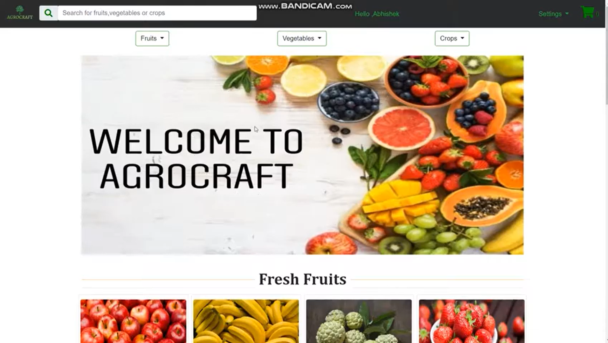
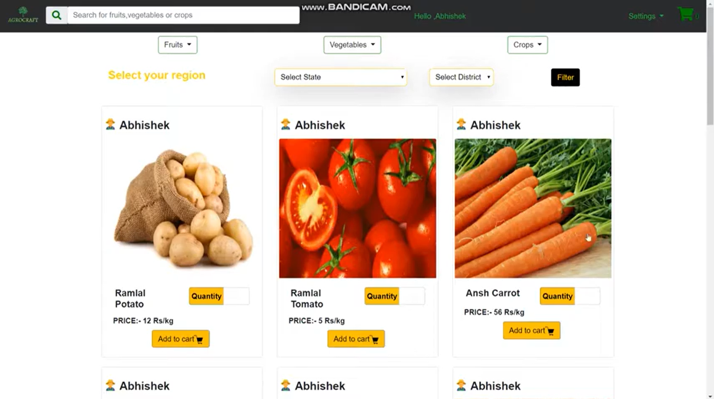
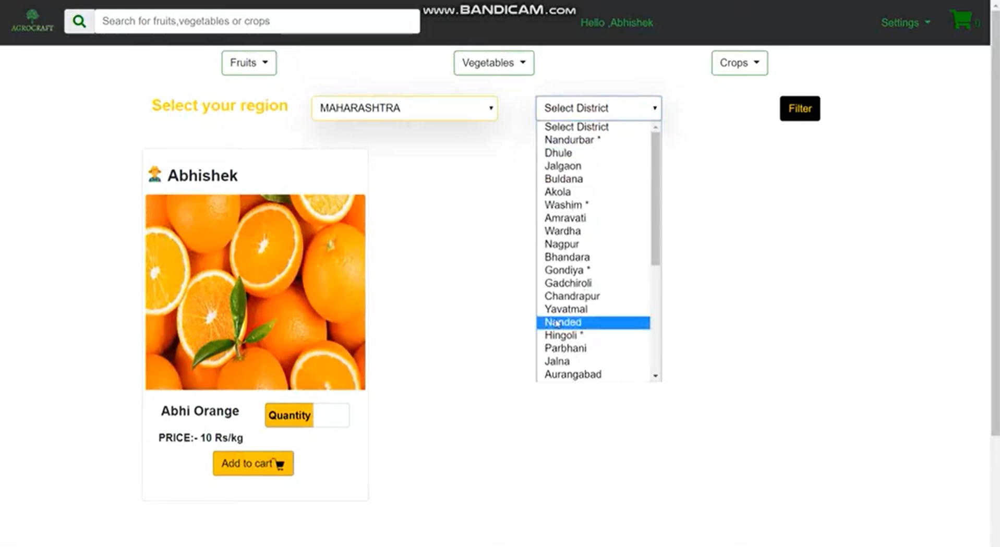

# Agrocraft An E-Commerce Website For Fresh Farm Produce Vegetables And Fruits

### Starter Images

      
  
   
 
   
 
   
 

### Demo Video :- https://youtu.be/f0YMvE3muIc

### Technology Stack 
* HTML
* CSS
* JAVASCRIPT
* PHP
* BOOTSTRAP

### Made By
<a href = "https://www.linkedin.com/in/abhishek-gupta-a745221a0/" >Abhishek Gupta </a> 
<a href = "https://www.linkedin.com/in/omkar-bhabal-620b56192/" >Omkar Bhabal</a>  
<a href = "https://www.linkedin.com/in/ansh-chhadva-ab3902183/" >Ansh Chhadva</a>  
<a href = "#" >Calista Gonsalves </a>  
<a href = "https://www.linkedin.com/in/gladina-raymond-2a56a8194/" >Gladina Raymond </a> 
<a href = "https://www.linkedin.com/in/arpit-bhat-00a37816a/" >Arpit Bhat</a>  
